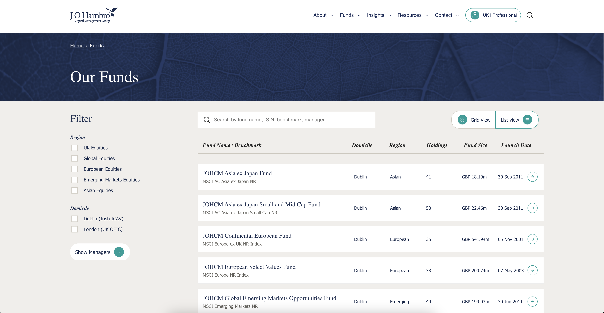
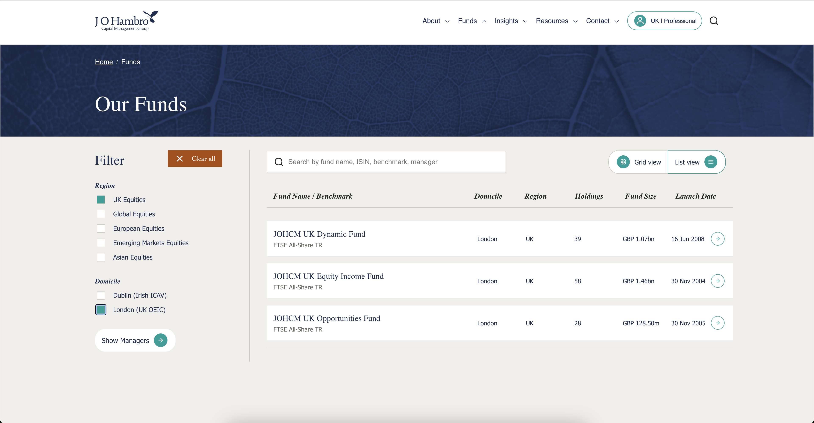

# React + TypeScript + Vite

# 💼 Fund Explorer

A simple React + TypeScript web app for browsing and filtering investment funds.  
Users can switch between **list** and **grid** views and filter results by **region** and **domicile**.


## 📸 Screenshots

### List View


### Grid View


### Grid View


## 🚀 Getting Started

### 📦 Install Dependencies

Run the following command to install all dependencies:

```bash
npm install
# or
yarn add
```

### Start the development server:

npm run dev

### 🧱 App Features

📃 Funds List View – Displays funds in a vertical list format.

🟩 Funds Grid View – Displays funds as cards in a responsive grid layout.

✅ Region Checkbox Filters – Filter funds by their investment region.

🏠 Domicile Checkbox Filters – Filter funds by where they are domiciled.

### 🛠️ Built With

⚛️ React + TypeScript

🎨 Vanilla CSS

📁 Vite for development/build tooling


